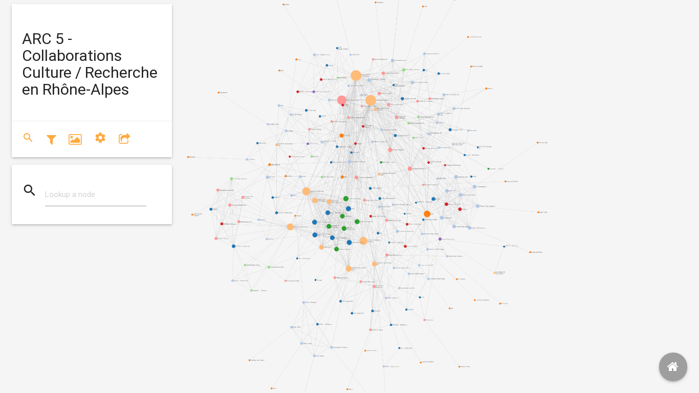

##### L'ARC5

[L’ARC 5 Culture, Sciences, Sociétés et Médiations](http://arc5-cultures.rhonealpes.fr) a pour but de structurer et stimuler la production de connaissances scientifiques en Rhône-Alpes à la fois sur les contenus culturels eux-mêmes et sur les pratiques sociales de leur formation et de leur transmission. Il fait partie du programme ARC (Academic Research Communities),  programmes thématiques de soutien à la recherche mis en place en 2001 par la région Rhône-Alpes et destinés à structurer des communautés de recherche autour des principes de coopération et de coordination régionales.

##### Panorama des relations entre recherche & culture en région Rhône-Alpes

Au moment où sont mises en œuvre de profondes recompositions territoriales, tant au niveau des collectivités que de l’enseignement supérieur, l’ARC 5 Cultures, Sciences, Sociétés et Médiations (anciennement Clusters 13 et 14) souhaite mettre en débat son bilan depuis 2006 et ses perspectives afin d’approfondir le dialogue entre culture et recherche. 

Dans cette optique, l’ARC 5 a lancé en 2015 un état des lieux axé sur l’évolution des coopérations entre recherche en Sciences Humaines et Sociales et Culture en région Rhône-Alpes autour de trois principaux objectifs :

1. Dresser un bilan des projets soutenus  par l’ARC 5 (et précédemment par les Clusters 13 et 14)
2. Étudier les dynamiques de coopération mises en place entre les mondes scientifique et culturel lors de ces collaborations
3. Présenter une photographie des activités de la recherche en Sciences Humaines et Sociales dans la région Rhône-Alpes.

##### Un bilan des activités de l’ARC5 en région

L’étude s’est appuyée sur les données relatives aux projets et thèses adossées à des crédits régionaux depuis 2006. Elle a consisté à repérer les domaines culturels les plus mobilisés dans ces coopérations, les résultats obtenus, les effets structurants, ainsi que les besoins et les perspectives en matière de partenariat entre recherche et culture. L’état des lieux s’est concentré sur les acteurs de la recherche (laboratoires, centres de recherche, chercheurs invités à participer à des comités scientifiques de colloques professionnels ou d’études commanditées) et de la culture (secteurs des arts, du patrimoine, des musées, de la lecture publique, du cinéma, de l’architecture, du design, de la culture scientifique, réseaux associatifs et militants, tiers lieux) en Rhône-Alpes.

##### Une cartographie dynamique

Afin de procéder à cette enquête, nous avons opté pour une méthodologie d’étude des réseaux de coopérations comprenant trois démarches méthodologiques complémentaires : 

1. la diffusion d’une enquête en ligne, 
2. la réalisation d’entretiens semi-­directifs 
3. et enfin la constitution d’une base de données puis d’une cartographie permettant de visualiser les réseaux et relations entre les différents acteurs en présence.

[Consulter la cartographie](./map) - réalisée avec [Topogram](http://topogram.io).

##### Télécharger et consulter les résultats de l'enquête


